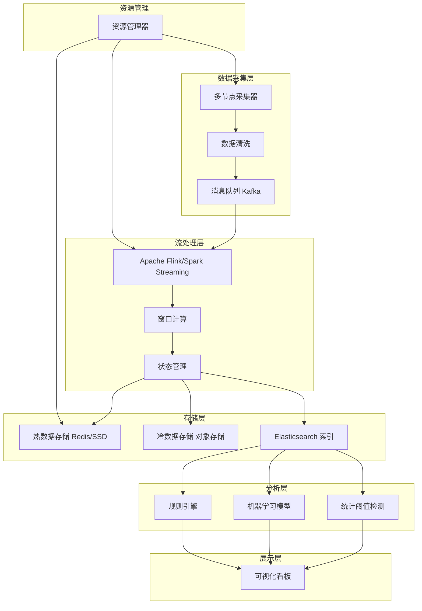

# Selfdrived 大规模数据监控技术架构

## 📖 概述

在现代数字化时代，企业需要处理和监控海量信息流，从用户行为数据到系统性能指标，从业务指标到安全事件。

Selfdrived 架构提供了一套完整的解决方案，能够实现对大量信息的持续、实时、智能监控。本文将解析这一架构的核心技术组件和实现方法。

## 🏗️ 整体架构概览



## 1. 分布式数据采集与处理 🔄

### 核心设计理念

分布式架构是处理海量数据的基础，通过将数据采集任务分散到多个节点，避免单点故障和性能瓶颈。

### 技术实现架构

```python
# 数据采集节点配置示例
class DataCollectorNode:
    def __init__(self, node_id, node_type="worker"):
        self.node_id = node_id
        self.node_type = node_type
        self.status = "active"
        self.capacity = 1000  # 每秒处理能力
      
    def collect_data(self, data_source):
        """数据采集主方法"""
        raw_data = self.fetch_from_source(data_source)
        cleaned_data = self.initial_cleaning(raw_data)
        self.send_to_queue(cleaned_data)
      
    def initial_cleaning(self, raw_data):
        """初步数据清洗"""
        # 去除无效字段、格式标准化、数据验证
        return {
            "timestamp": raw_data.get("timestamp"),
            "source": raw_data.get("source"),
            "data": self.validate_and_normalize(raw_data.get("data")),
            "metadata": raw_data.get("metadata", {})
        }
```

### 动态扩展机制

```yaml
# Kubernetes 部署配置示例
apiVersion: apps/v1
kind: Deployment
metadata:
  name: data-collector
spec:
  replicas: 3  # 初始节点数
  selector:
    matchLabels:
      app: data-collector
  template:
    metadata:
      labels:
        app: data-collector
    spec:
      containers:
      - name: collector
        image: selfdrived/data-collector:latest
        resources:
          requests:
            memory: "256Mi"
            cpu: "250m"
          limits:
            memory: "512Mi"
            cpu: "500m"
---
apiVersion: autoscaling/v2
kind: HorizontalPodAutoscaler
metadata:
  name: collector-hpa
spec:
  scaleTargetRef:
    apiVersion: apps/v1
    kind: Deployment
    name: data-collector
  minReplicas: 3
  maxReplicas: 20
  metrics:
  - type: Resource
    resource:
      name: cpu
      target:
        type: Utilization
        averageUtilization: 70
```

### 消息队列集成

```java
// Kafka 生产者配置
@Configuration
public class KafkaProducerConfig {
  
    @Bean
    public ProducerFactory<String, Object> producerFactory() {
        Map<String, Object> configProps = new HashMap<>();
        configProps.put(ProducerConfig.BOOTSTRAP_SERVERS_CONFIG, "kafka-cluster:9092");
        configProps.put(ProducerConfig.KEY_SERIALIZER_CLASS_CONFIG, StringSerializer.class);
        configProps.put(ProducerConfig.VALUE_SERIALIZER_CLASS_CONFIG, JsonSerializer.class);
      
        // 高吞吐量优化配置
        configProps.put(ProducerConfig.BATCH_SIZE_CONFIG, 16384);
        configProps.put(ProducerConfig.LINGER_MS_CONFIG, 10);
        configProps.put(ProducerConfig.BUFFER_MEMORY_CONFIG, 33554432);
      
        return new DefaultKafkaProducerFactory<>(configProps);
    }
}
```

## 2. 实时流处理技术 ⚡

### Apache Flink 流处理实现

```java
// Flink 流处理作业
public class RealTimeMonitoringJob {
  
    public static void main(String[] args) throws Exception {
        StreamExecutionEnvironment env = StreamExecutionEnvironment.getExecutionEnvironment();
      
        // 配置检查点
        env.enableCheckpointing(60000); // 1分钟检查点
        env.getCheckpointConfig().setCheckpointingMode(CheckpointingMode.EXACTLY_ONCE);
      
        // 数据源
        DataStream<MonitoringEvent> source = env
            .addSource(new FlinkKafkaConsumer<>("monitoring-events", 
                new MonitoringEventDeserializer(), kafkaProps))
            .assignTimestampsAndWatermarks(
                WatermarkStrategy.<MonitoringEvent>forBoundedOutOfOrderness(Duration.ofSeconds(20))
                    .withTimestampAssigner((event, timestamp) -> event.getEventTime()));
      
        // 窗口处理
        source
            .keyBy(MonitoringEvent::getSourceSystem)
            .window(TumblingEventTimeWindows.of(Time.minutes(1)))
            .aggregate(new MonitoringAggregator())
            .addSink(new AlertingSink());
      
        env.execute("Real-time Monitoring Job");
    }
}

// 自定义聚合器
public class MonitoringAggregator implements AggregateFunction<MonitoringEvent, EventAccumulator, AlertResult> {
  
    @Override
    public EventAccumulator add(MonitoringEvent event, EventAccumulator accumulator) {
        accumulator.addEvent(event);
        accumulator.updateMetrics(event);
        return accumulator;
    }
  
    @Override
    public AlertResult getResult(EventAccumulator accumulator) {
        return new AlertResult(
            accumulator.getWindowStart(),
            accumulator.getWindowEnd(),
            accumulator.getEventCount(),
            accumulator.getAnomalyScore(),
            accumulator.getSourceSystem()
        );
    }
}
```

### 窗口计算策略

```scala
// Spark Streaming 窗口处理示例
import org.apache.spark.streaming.dstream.DStream
import org.apache.spark.streaming.{Seconds, StreamingContext}

object WindowedProcessing {
  
  def processWithSlidingWindow(stream: DStream[MonitoringEvent]): DStream[WindowedResult] = {
    stream
      .window(windowLength = Seconds(300), slideInterval = Seconds(60)) // 5分钟窗口，1分钟滑动
      .map(event => (event.sourceSystem, event))
      .groupByKey()
      .mapValues(events => {
        val eventList = events.toList
        WindowedResult(
          eventCount = eventList.size,
          avgLatency = calculateAvgLatency(eventList),
          errorRate = calculateErrorRate(eventList),
          anomalyScore = detectAnomalies(eventList)
        )
      })
  }
  
  def processWithTumblingWindow(stream: DStream[MonitoringEvent]): DStream[TumblingResult] = {
    stream
      .window(windowLength = Seconds(60), slideInterval = Seconds(60)) // 1分钟滚动窗口
      .transform(rdd => {
        rdd.groupBy(_.sourceSystem)
           .mapValues(calculateMetrics)
      })
  }
}
```

## 3. 分层存储与索引优化 🗄️

### 冷热数据分层策略

```python
class DataTieringManager:
    def __init__(self):
        self.hot_storage = RedisCluster(hosts=['redis1:6379', 'redis2:6379'])
        self.warm_storage = ClickHouseClient()
        self.cold_storage = S3Client()
      
    def store_data(self, data, priority="normal"):
        """根据数据热度和优先级选择存储层"""
        current_time = datetime.now()
      
        if self.is_hot_data(data, current_time):
            # 热数据存储到Redis
            self.hot_storage.setex(
                name=f"hot:{data['id']}", 
                time=3600,  # 1小时TTL
                value=json.dumps(data)
            )
          
        elif self.is_warm_data(data, current_time):
            # 温数据存储到ClickHouse
            self.warm_storage.execute("""
                INSERT INTO monitoring_events 
                (timestamp, source_system, event_type, data) 
                VALUES
            """, (data['timestamp'], data['source'], data['type'], data['payload']))
          
        else:
            # 冷数据存储到S3
            s3_key = f"cold_data/{data['timestamp'].strftime('%Y/%m/%d')}/{data['id']}.json"
            self.cold_storage.put_object(
                Bucket='monitoring-archive',
                Key=s3_key,
                Body=json.dumps(data)
            )
  
    def is_hot_data(self, data, current_time):
        """判断是否为热数据（最近1小时且高频访问）"""
        data_time = datetime.fromisoformat(data['timestamp'])
        time_diff = current_time - data_time
        return time_diff.total_seconds() < 3600 and data.get('access_frequency', 0) > 10
```

### Elasticsearch 索引优化

```json
{
  "settings": {
    "number_of_shards": 12,
    "number_of_replicas": 1,
    "index.refresh_interval": "30s",
    "index.translog.flush_threshold_size": "1gb",
    "index.codec": "best_compression"
  },
  "mappings": {
    "properties": {
      "@timestamp": {
        "type": "date",
        "format": "strict_date_optional_time||epoch_millis"
      },
      "source_system": {
        "type": "keyword",
        "index": true
      },
      "event_type": {
        "type": "keyword",
        "index": true
      },
      "severity": {
        "type": "keyword",
        "index": true
      },
      "message": {
        "type": "text",
        "analyzer": "standard",
        "fields": {
          "keyword": {
            "type": "keyword",
            "ignore_above": 256
          }
        }
      },
      "metrics": {
        "type": "nested",
        "properties": {
          "name": {"type": "keyword"},
          "value": {"type": "double"},
          "unit": {"type": "keyword"}
        }
      },
      "tags": {
        "type": "keyword",
        "index": true
      }
    }
  }
}
```

### 多级索引策略

```python
class MultiLevelIndexManager:
    def __init__(self):
        self.es_client = Elasticsearch(['es1:9200', 'es2:9200', 'es3:9200'])
      
    def create_time_based_indices(self):
        """创建基于时间的索引"""
        today = datetime.now()
      
        # 按小时创建索引（最近24小时）
        for hour in range(24):
            index_time = today - timedelta(hours=hour)
            index_name = f"monitoring-{index_time.strftime('%Y.%m.%d.%H')}"
            self.create_hourly_index(index_name)
      
        # 按天创建索引（最近30天）
        for day in range(30):
            index_time = today - timedelta(days=day)
            index_name = f"monitoring-daily-{index_time.strftime('%Y.%m.%d')}"
            self.create_daily_index(index_name)
  
    def search_with_index_optimization(self, query, time_range):
        """基于时间范围优化搜索索引"""
        indices = self.get_relevant_indices(time_range)
      
        search_body = {
            "query": query,
            "sort": [{"@timestamp": {"order": "desc"}}],
            "size": 1000
        }
      
        return self.es_client.search(
            index=indices,
            body=search_body,
            request_timeout=30
        )
```

## 4. 异常检测算法 🤖

### 多模型并行检测架构

```python
class AnomalyDetectionEngine:
    def __init__(self):
        self.detectors = {
            'statistical': StatisticalDetector(),
            'isolation_forest': IsolationForestDetector(),
            'lstm': LSTMDetector(),
            'rule_engine': RuleBasedDetector()
        }
        self.model_weights = {
            'statistical': 0.2,
            'isolation_forest': 0.3,
            'lstm': 0.4,
            'rule_engine': 0.1
        }
  
    async def detect_anomalies(self, data_batch):
        """并行执行多种检测算法"""
        tasks = []
      
        for detector_name, detector in self.detectors.items():
            task = asyncio.create_task(
                self.run_detector(detector, data_batch, detector_name)
            )
            tasks.append(task)
      
        results = await asyncio.gather(*tasks)
      
        # 加权融合结果
        final_score = self.weighted_fusion(results)
        return self.classify_anomaly(final_score, data_batch)
  
    def weighted_fusion(self, detection_results):
        """加权融合多个检测器的结果"""
        weighted_scores = []
      
        for result in detection_results:
            detector_name = result['detector']
            score = result['anomaly_score']
            weight = self.model_weights.get(detector_name, 0.25)
            weighted_scores.append(score * weight)
      
        return sum(weighted_scores)
```

### 统计阈值检测

```python
class StatisticalDetector:
    def __init__(self, window_size=1000, threshold_std=3):
        self.window_size = window_size
        self.threshold_std = threshold_std
        self.historical_data = deque(maxlen=window_size)
  
    def detect(self, current_value):
        """基于Z-score的异常检测"""
        if len(self.historical_data) < 30:  # 最少需要30个样本
            self.historical_data.append(current_value)
            return {'anomaly_score': 0.0, 'is_anomaly': False}
      
        mean = np.mean(self.historical_data)
        std = np.std(self.historical_data)
      
        if std == 0:  # 避免除零错误
            z_score = 0
        else:
            z_score = abs(current_value - mean) / std
      
        is_anomaly = z_score > self.threshold_std
        anomaly_score = min(z_score / self.threshold_std, 1.0)
      
        self.historical_data.append(current_value)
      
        return {
            'anomaly_score': anomaly_score,
            'is_anomaly': is_anomaly,
            'z_score': z_score,
            'mean': mean,
            'std': std
        }
```

### LSTM 时序异常检测

```python
import tensorflow as tf
from tensorflow.keras.models import Sequential
from tensorflow.keras.layers import LSTM, Dense, Dropout

class LSTMDetector:
    def __init__(self, sequence_length=60, feature_dim=1):
        self.sequence_length = sequence_length
        self.feature_dim = feature_dim
        self.model = self.build_model()
        self.scaler = StandardScaler()
      
    def build_model(self):
        """构建LSTM自编码器模型"""
        model = Sequential([
            LSTM(64, return_sequences=True, input_shape=(self.sequence_length, self.feature_dim)),
            Dropout(0.2),
            LSTM(32, return_sequences=True),
            Dropout(0.2),
            LSTM(16, return_sequences=False),
            Dense(16, activation='relu'),
            Dense(32, activation='relu'),
            Dense(self.sequence_length, activation='linear')
        ])
      
        model.compile(optimizer='adam', loss='mse', metrics=['mae'])
        return model
  
    def train(self, normal_data):
        """使用正常数据训练模型"""
        # 数据预处理
        scaled_data = self.scaler.fit_transform(normal_data.reshape(-1, 1))
      
        # 创建序列
        X_train = []
        for i in range(self.sequence_length, len(scaled_data)):
            X_train.append(scaled_data[i-self.sequence_length:i])
      
        X_train = np.array(X_train)
      
        # 训练模型（自编码器，输入等于输出）
        self.model.fit(
            X_train, X_train.reshape(X_train.shape[0], -1),
            epochs=100,
            batch_size=32,
            validation_split=0.2,
            verbose=0
        )
  
    def detect(self, sequence):
        """检测序列中的异常"""
        if len(sequence) < self.sequence_length:
            return {'anomaly_score': 0.0, 'is_anomaly': False}
      
        # 预处理
        scaled_sequence = self.scaler.transform(sequence.reshape(-1, 1))
        input_sequence = scaled_sequence[-self.sequence_length:].reshape(1, self.sequence_length, 1)
      
        # 预测
        reconstruction = self.model.predict(input_sequence, verbose=0)
      
        # 计算重构误差
        mse = np.mean(np.square(input_sequence.flatten() - reconstruction.flatten()))
      
        # 基于历史误差分布计算异常分数
        anomaly_score = min(mse / 0.1, 1.0)  # 0.1是经验阈值
        is_anomaly = anomaly_score > 0.7
      
        return {
            'anomaly_score': anomaly_score,
            'is_anomaly': is_anomaly,
            'reconstruction_error': mse
        }
```

### 规则引擎

```python
class RuleBasedDetector:
    def __init__(self):
        self.rules = []
        self.load_rules()
  
    def load_rules(self):
        """加载检测规则"""
        self.rules = [
            {
                'name': 'cpu_usage_spike',
                'condition': lambda data: data.get('cpu_usage', 0) > 90,
                'severity': 'high',
                'weight': 1.0
            },
            {
                'name': 'error_rate_high',
                'condition': lambda data: data.get('error_rate', 0) > 0.05,
                'severity': 'medium',
                'weight': 0.8
            },
            {
                'name': 'response_time_slow',
                'condition': lambda data: data.get('response_time', 0) > 5000,
                'severity': 'medium',
                'weight': 0.6
            },
            {
                'name': 'disk_space_low',
                'condition': lambda data: data.get('disk_usage', 0) > 85,
                'severity': 'high',
                'weight': 0.9
            }
        ]
  
    def detect(self, data):
        """基于规则检测异常"""
        triggered_rules = []
        total_score = 0.0
      
        for rule in self.rules:
            try:
                if rule['condition'](data):
                    triggered_rules.append(rule['name'])
                    total_score += rule['weight']
            except Exception as e:
                # 规则执行失败时的处理
                pass
      
        # 归一化分数
        max_possible_score = sum(rule['weight'] for rule in self.rules)
        normalized_score = min(total_score / max_possible_score, 1.0) if max_possible_score > 0 else 0.0
      
        return {
            'anomaly_score': normalized_score,
            'is_anomaly': len(triggered_rules) > 0,
            'triggered_rules': triggered_rules
        }
```

## 5. 资源动态调度 ⚖️

### 自适应资源管理器

```python
class ResourceManager:
    def __init__(self):
        self.k8s_client = kubernetes.client.ApiClient()
        self.metrics_client = MetricsCollector()
        self.sla_config = {
            'max_latency': 5000,  # 最大延迟5秒
            'min_throughput': 1000,  # 最小吞吐量1000/秒
            'max_cpu_usage': 80,  # 最大CPU使用率80%
            'max_memory_usage': 85  # 最大内存使用率85%
        }
      
    async def auto_scale(self):
        """自动扩缩容逻辑"""
        while True:
            try:
                current_metrics = await self.collect_metrics()
                scaling_decision = self.make_scaling_decision(current_metrics)
              
                if scaling_decision['action'] != 'no_action':
                    await self.execute_scaling(scaling_decision)
              
                await asyncio.sleep(30)  # 每30秒检查一次
              
            except Exception as e:
                logger.error(f"Auto-scaling error: {e}")
                await asyncio.sleep(60)  # 错误时延长检查间隔
  
    def make_scaling_decision(self, metrics):
        """基于SLA指标做出扩缩容决策"""
        current_latency = metrics.get('avg_latency', 0)
        current_throughput = metrics.get('throughput', 0)
        current_cpu = metrics.get('avg_cpu_usage', 0)
        current_memory = metrics.get('avg_memory_usage', 0)
        current_replicas = metrics.get('replica_count', 1)
      
        # 扩容条件
        should_scale_up = (
            current_latency > self.sla_config['max_latency'] or
            current_throughput < self.sla_config['min_throughput'] or
            current_cpu > self.sla_config['max_cpu_usage'] or
            current_memory > self.sla_config['max_memory_usage']
        )
      
        # 缩容条件
        should_scale_down = (
            current_latency < self.sla_config['max_latency'] * 0.5 and
            current_throughput > self.sla_config['min_throughput'] * 1.5 and
            current_cpu < self.sla_config['max_cpu_usage'] * 0.5 and
            current_memory < self.sla_config['max_memory_usage'] * 0.5 and
            current_replicas > 2  # 最少保持2个副本
        )
      
        if should_scale_up:
            new_replicas = min(current_replicas * 2, 50)  # 最多50个副本
            return {
                'action': 'scale_up',
                'current_replicas': current_replicas,
                'target_replicas': new_replicas,
                'reason': 'SLA violation detected'
            }
        elif should_scale_down:
            new_replicas = max(current_replicas // 2, 2)  # 最少2个副本
            return {
                'action': 'scale_down',
                'current_replicas': current_replicas,
                'target_replicas': new_replicas,
                'reason': 'Resource utilization low'
            }
        else:
            return {'action': 'no_action'}
```

### Kubernetes HPA 配置

```yaml
# 自定义指标的HPA配置
apiVersion: autoscaling/v2
kind: HorizontalPodAutoscaler
metadata:
  name: monitoring-hpa
  namespace: monitoring
spec:
  scaleTargetRef:
    apiVersion: apps/v1
    kind: Deployment
    name: monitoring-service
  minReplicas: 2
  maxReplicas: 50
  metrics:
  # CPU使用率
  - type: Resource
    resource:
      name: cpu
      target:
        type: Utilization
        averageUtilization: 70
  # 内存使用率
  - type: Resource
    resource:
      name: memory
      target:
        type: Utilization
        averageUtilization: 80
  # 自定义指标：队列长度
  - type: Pods
    pods:
      metric:
        name: kafka_consumer_lag
      target:
        type: AverageValue
        averageValue: "1000"
  # 自定义指标：请求延迟
  - type: Pods
    pods:
      metric:
        name: request_latency_p99
      target:
        type: AverageValue
        averageValue: "5000m"  # 5秒
  behavior:
    scaleUp:
      stabilizationWindowSeconds: 60  # 扩容稳定窗口
      policies:
      - type: Percent
        value: 100  # 最多扩容100%
        periodSeconds: 60
      - type: Pods
        value: 10   # 最多一次增加10个Pod
        periodSeconds: 60
    scaleDown:
      stabilizationWindowSeconds: 300  # 缩容稳定窗口
      policies:
      - type: Percent
        value: 50   # 最多缩容50%
        periodSeconds: 60
```

### 成本优化策略

```python
class CostOptimizer:
    def __init__(self):
        self.spot_instance_manager = SpotInstanceManager()
        self.reserved_capacity = ReservedCapacityManager()
      
    def optimize_compute_costs(self, workload_forecast):
        """基于工作负载预测优化计算成本"""
        recommendations = []
      
        # 预测未来24小时的负载
        hourly_forecast = workload_forecast.get_hourly_prediction(24)
      
        for hour, predicted_load in enumerate(hourly_forecast):
            if predicted_load < 0.3:  # 低负载时段
                recommendations.append({
                    'time': hour,
                    'action': 'use_spot_instances',
                    'target_spot_ratio': 0.8,  # 80%使用Spot实例
                    'expected_savings': 0.6
                })
            elif predicted_load > 0.8:  # 高负载时段
                recommendations.append({
                    'time': hour,
                    'action': 'scale_to_on_demand',
                    'target_spot_ratio': 0.3,  # 30%使用Spot实例
                    'expected_savings': 0.2
                })
      
        return recommendations
  
    def implement_cost_optimization(self, recommendations):
        """实施成本优化建议"""
        for rec in recommendations:
            if rec['action'] == 'use_spot_instances':
                self.spot_instance_manager.increase_spot_ratio(
                    target_ratio=rec['target_spot_ratio']
                )
            elif rec['action'] == 'scale_to_on_demand':
                self.spot_instance_manager.decrease_spot_ratio(
                    target_ratio=rec['target_spot_ratio']
                )
```

## 6. 性能优化与最佳实践 🚀

### 缓存策略

```python
class MultiLevelCache:
    def __init__(self):
        self.l1_cache = {}  # 内存缓存
        self.l2_cache = redis.Redis(host='redis-cluster')  # Redis缓存
        self.l3_cache = memcached.Client(['memcached1:11211'])  # Memcached
      
    async def get(self, key):
        """多级缓存读取"""
        # L1: 内存缓存
        if key in self.l1_cache:
            return self.l1_cache[key]
      
        # L2: Redis缓存
        value = await self.l2_cache.get(key)
        if value:
            self.l1_cache[key] = value  # 写入L1缓存
            return value
      
        # L3: Memcached
        value = self.l3_cache.get(key)
        if value:
            await self.l2_cache.setex(key, 3600, value)  # 写入L2缓存
            self.l1_cache[key] = value  # 写入L1缓存
            return value
      
        return None
  
    async def set(self, key, value, ttl=3600):
        """多级缓存写入"""
        # 写入所有级别的缓存
        self.l1_cache[key] = value
        await self.l2_cache.setex(key, ttl, value)
        self.l3_cache.set(key, value, time=ttl)
```

### 批处理优化

```python
class BatchProcessor:
    def __init__(self, batch_size=1000, max_wait_time=5):
        self.batch_size = batch_size
        self.max_wait_time = max_wait_time
        self.pending_batch = []
        self.last_flush_time = time.time()
      
    async def add_item(self, item):
        """添加项目到批处理队列"""
        self.pending_batch.append(item)
      
        # 检查是否需要刷新批次
        should_flush = (
            len(self.pending_batch) >= self.batch_size or
            time.time() - self.last_flush_time >= self.max_wait_time
        )
      
        if should_flush:
            await self.flush_batch()
  
    async def flush_batch(self):
        """刷新当前批次"""
        if not self.pending_batch:
            return
      
        batch_to_process = self.pending_batch.copy()
        self.pending_batch.clear()
        self.last_flush_time = time.time()
      
        # 并行处理批次
        await self.process_batch(batch_to_process)
  
    async def process_batch(self, batch):
        """处理一个批次的数据"""
        tasks = []
        chunk_size = 100
      
        for i in range(0, len(batch), chunk_size):
            chunk = batch[i:i + chunk_size]
            task = asyncio.create_task(self.process_chunk(chunk))
            tasks.append(task)
      
        await asyncio.gather(*tasks)
```

## 7. 监控与告警系统 📊

### 可视化看板配置

```json
{
  "dashboard": {
    "title": "Selfdrived 监控总览",
    "panels": [
      {
        "title": "实时数据流量",
        "type": "graph",
        "targets": [
          {
            "expr": "rate(data_ingestion_total[5m])",
            "legendFormat": "数据摄取速率"
          }
        ]
      },
      {
        "title": "异常检测结果",
        "type": "stat",
        "targets": [
          {
            "expr": "sum(anomaly_detection_alerts_total)",
            "legendFormat": "总异常数"
          }
        ]
      },
      {
        "title": "系统资源使用",
        "type": "heatmap",
        "targets": [
          {
            "expr": "avg(cpu_usage) by (instance)",
            "legendFormat": "CPU使用率"
          },
          {
            "expr": "avg(memory_usage) by (instance)",
            "legendFormat": "内存使用率"
          }
        ]
      },
      {
        "title": "SLA指标",
        "type": "gauge",
        "targets": [
          {
            "expr": "histogram_quantile(0.99, request_duration_seconds_bucket)",
            "legendFormat": "P99延迟"
          }
        ]
      }
    ]
  }
}
```

### 智能告警规则

```yaml
# Prometheus 告警规则
groups:
- name: selfdrived.rules
  rules:
  # 数据流量异常
  - alert: DataIngestionRateDrop
    expr: rate(data_ingestion_total[5m]) < 100
    for: 2m
    labels:
      severity: warning
    annotations:
      summary: "数据摄取速率异常下降"
      description: "数据摄取速率在过去5分钟内低于100/秒，持续2分钟"
  
  # 异常检测模型失效
  - alert: AnomalyDetectionModelDown
    expr: up{job="anomaly-detection"} == 0
    for: 1m
    labels:
      severity: critical
    annotations:
      summary: "异常检测模型服务不可用"
      description: "异常检测服务已停止响应超过1分钟"
  
  # SLA违规
  - alert: SLAViolation
    expr: histogram_quantile(0.99, request_duration_seconds_bucket) > 5
    for: 5m
    labels:
      severity: critical
    annotations:
      summary: "SLA违规：响应时间过高"
      description: "P99响应时间超过5秒，持续5分钟"
  
  # 资源使用异常
  - alert: HighResourceUsage
    expr: avg(cpu_usage) > 90 or avg(memory_usage) > 95
    for: 3m
    labels:
      severity: warning
    annotations:
      summary: "系统资源使用率过高"
      description: "CPU或内存使用率持续3分钟超过阈值"
```

## 🎯 总结

Selfdrived 大规模数据监控架构通过以下核心技术实现了对海量信息的持续、智能监控：

### 关键技术优势

1. **高可扩展性**：分布式架构支持横向扩展，能够处理PB级数据
2. **实时性**：流处理技术确保毫秒级的数据处理延迟
3. **智能化**：多模型融合的异常检测，提供准确的异常识别
4. **自适应**：动态资源调度和成本优化，实现自动化运维
5. **高可用性**：多级缓存和故障恢复机制，确保系统稳定性

### 实施建议

1. **分阶段实施**：从核心组件开始，逐步扩展功能模块
2. **监控优先**：建立完善的监控体系，确保系统可观测性
3. **性能调优**：根据实际负载情况调整配置参数
4. **成本控制**：合理使用云资源，实施成本优化策略

这套架构不仅能够满足当前的监控需求，还具备良好的扩展性，能够适应未来业务增长和技术演进的需要。通过持续优化和调整，可以构建出一个高效、可靠、智能的大规模数据监控系统。

---

**标签**: `大数据` `实时监控` `异常检测` `分布式系统` `微服务架构` `机器学习` `自动化运维`

**作者**: Lvy
**更新时间**: 2025年8月
**版本**: v1.0
